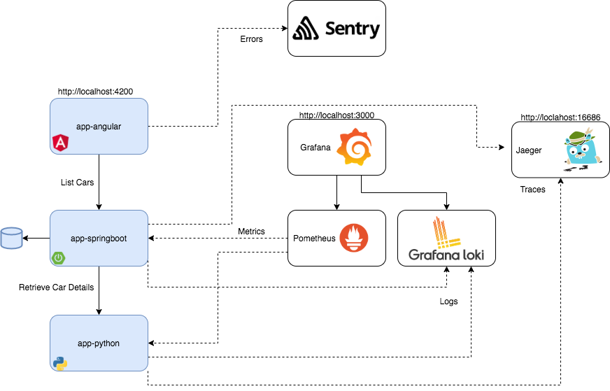

# Full observability demo

Demo of observability capabilities with different frameworks.


docker-compose up -d --build

# Architecture and URLs

Jaeger : http://localhost:16686   
Prometheus : http://localhost:9090   
Grafana : http://localhost:3000   (user: admin / pass: workshop)
Sentry : https://sentry.io/demo-lm/angular/getting-started/javascript-angular/
app-python : http://localhost:5000  
app-springboot : http://localhost:8080  
app-angular : http://localhost:4200/



# Setup

## Setup logs Docker to Loki

```
docker plugin install grafana/loki-docker-driver:latest --alias loki --grant-all-permissions
docker plugin ls
docker plugin enable loki
```

### Configure
https://github.com/grafana/loki/blob/master/docs/clients/docker-driver/configuration.md

specify driver in docker-compose service 
```yaml
    logging:
      driver: loki
      options:
        loki-url: "http://localhost:3100/loki/api/v1/push"
```

### To remove

```
docker plugin disable loki
docker plugin rm loki
```

--- 
# Resources

- [Spring Boot Tutorial - Bootstrap a Simple App | Baeldung](https://www.baeldung.com/spring-boot-start)
- [Hawkular - OpenTracing Spring Boot Instrumentation](https://www.hawkular.org/blog/2017/06/9/opentracing-spring-boot.html)
- [OpenTracing Spring Cloud](https://github.com/opentracing-contrib/java-spring-cloud)
- [OpenTracing Spring Boot Instrumentation - DZone Java](https://dzone.com/articles/opentracing-spring-boot-instrumentation)
- [Mission Control : JVM + IoT = FUN : Deep dive into distributed tracing with Spring Boot and Flight Recorder](http://www.wengnermiro.com/2018/12/deep-dive-into-distributed-tracing-with.html)
- [Mastering Distributed Tracing: Analyzing performance in microservices and … - Yuri Shkuro - Google Livres](https://books.google.be/books?id=4AuLDwAAQBAJ&pg=PA149&lpg=PA149&dq=example+opentracing-spring-cloud-starter&source=bl&ots=Of1FBVdgjC&sig=ACfU3U3T2EOI0cKjiO-P_upcnQ4agXjbLg&hl=fr&sa=X&ved=2ahUKEwja8diimrbnAhVNLVAKHfG1DMMQ6AEwEnoECAwQAQ#v=onepage&q=example%20opentracing-spring-cloud-starter&f=false)
- [Mastering-Distributed-Tracing/Chapter04 at master · PacktPublishing/Mastering-Distributed-Tracing · GitHub](https://github.com/PacktPublishing/Mastering-Distributed-Tracing/tree/master/Chapter04)
- [GitHub - opentracing-contrib/java-spring-jaeger](https://github.com/opentracing-contrib/java-spring-jaeger)
- [Grafana Dashboard for official Prometheus Python Client's metrics](https://github.com/pilosus/prometheus-client-python-app-grafana-dashboard)
- [Angular sentry](https://nils-mehlhorn.de/posts/angular-error-tracking-with-sentry)

## Sentry

https://nils-mehlhorn.de/posts/angular-error-tracking-with-sentry

For simplicity we use sentry.io , but you can use docker-compose
https://gist.github.com/denji/b801f19d95b7d7910982c22bb1478f96
https://github.com/yhirano55/sentry-docker-compose/blob/master/docker-compose.yml


--- 

# TODO
- Add trace_id in logs and link to dashboard jaeger [Standard logging integration #92](https://github.com/opentracing-contrib/java-spring-cloud/issues/92)
- Grab metrics from python app with prometheus
- Add trace id in logs python app
- Create angular frontend and add opentracing https://doc.esdoc.org/github.com/opentracing/opentracing-javascript/
- Angular https://www.techiediaries.com/angular/angular-9-8-tutorial-by-example-rest-crud-apis-http-get-requests-with-httpclient/
